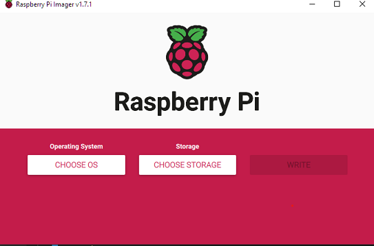
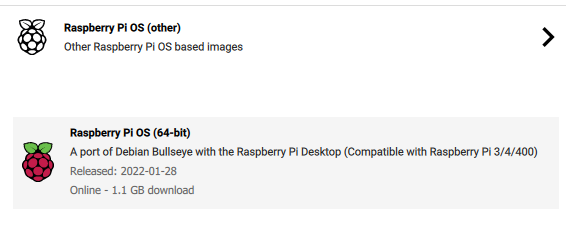

#  Create Rpi image

- Use Raspberry pi imager
- Select 64 bit (arm64) Raspberry Pi OS (64 bit) (see images below)
- Select wifi and ssh 
- set user: frits
- set wifi router to home router with passphrase
- set pwd : rasp##  where  ## is  pi number 
- set locale: US and  UTF-8 
- set time-zone: EU and  Amsterdam
- document  SSID and set IP adress for SSID in router





# Rpi setup data

| number| type| SSID| IP| User| Pwd | installed
|--|--|--|--|--|--|--|
| 01| 3B| RPI01| 192.168.2.45| frits| rasp01 | 08-03-2022 |
| 02| 3B| RPI02| 192.168.2.47| frits| rasp02 ||
| 03| 3B| RPI03| 192.168.2.48| frits| rasp03 ||
| 04| 3B| RPI04| 192.168.2.46| frits| rasp04 | 27-02-2022 |

---
# Check OS

Open a terminal and check if result from next  command conatains `aarch64`.
```bash
uname -a
```

# Disable Bluetooth
Run the following commands and reboot to see result in taskbar.

```bash
# open config 
sudo nano /boot/config.txt

# following lines  to end of file, save and exit
# disable bluetooth
dtoverlay=disable-bt
```

# Configure ssh for use with Teamcity

- first upload the SSH private key to right project in Teamcity

```
http://localhost:9090/admin/editProject.html?projectId=Bluetrain&tab=ssh-manager
```

- login to RPI using SSH
- create folder `mkdir home/.ssh`
- on windows powershell prompt
- navigate to .ssh folder:  C:Users\Frits Ankersmit\\.ssh  
  
```
type .\bluetrain-key-rsa.pub | ssh {IP-ADRESS} "cat >> .ssh/authorized_keys"
```

Be sure to replace {IP_ADRESS} with the actual adress. Answer Yes when prompted.
The teamcity deploy build ow uses SSH and key to automatically deploy builds.    

# Install latest dotnet

- Go to  `https://dotnet.microsoft.com/en-us/download/dotnet/6.0`
- Select linux arm64  download
- Navigate to  `$HOME/downloads`
- Run following commands

```bash
mkdir -p $HOME/dotnet && tar zxf dotnet-sdk-6.0.100-rc.1.21458.32-linux-arm.tar.gz -C $HOME/dotnet
export DOTNET_ROOT=$HOME/dotnet
export PATH=$PATH:$HOME/dotnet
```

- make permanent through:

```bash 
# Run nano editor to edit the .bashrc
nano ~/.bashrc
 
# Copy the commands below to the .bashrc
export DOTNET_ROOT=$HOME/dotnet
export PATH=$PATH:$HOME/dotnet
 
# Run this command so the terminal session will use the new settings
source ~/.bashrc
```
- check by typing

```bash
dotnet --info
```

# Update OS,  Install visual studio  code 

```bash
sudo apt update
sudo apt autoremove
sudo apt install code
```

# Configure /var/www for deployments

To give  Teamcity Deploy the right permissions tpo deploy to  /var/www/bluetrain run the following commands  

```bash
# replace some user with the default pi user
sudo usermod -a -G www-data <some_user>

# set the correct permissions on /var/www.
sudo chgrp -R www-data /var/www
sudo chmod -R g+w /var/www

# make sure that all new files and directories created under /var/www are owned by the www-data group.
sudo find /var/www -type d -exec chmod 2775 {} \;  

# Find all files in /var/www and add read and write permission for owner and group:
sudo find /var/www -type f -exec chmod ug+rw {} \;

# You might have to log out and log back in to be able to make changes if you're editing permission for your own account
```


