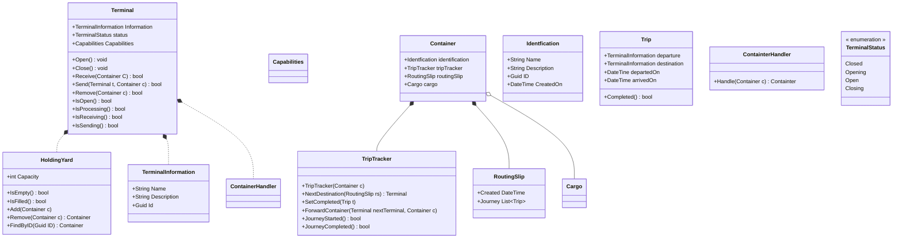

# BlueTrain

Project demonstrating the possibilities of ansering a question, by visiting different terminals with information holding and processing power.
It is inspired by he vision of the Dutch PHT project.
It concentrates on the routing and ordering problems in a distributed environment.
Possible uses are data processing without actually having the data yourself. 

# The story

A ***question*** is packaged into a ***container***. The container travels through any number of ***terminals***. 
This is called a ***journey***. Each terminal adds information or processes information which together constitutes the answer. 
Traveling from one terminal to another is called a ***trip***. The journey itself is logged onto a ***routing slip***.

# Terminal

A terminal is accessible through its REST-API. This project provides the interface definition and one implementation.

## Sending a container

A ***Terminal*** can ***Send*** and ***Receive*** any ***Container***. 
A Terminal can only receive a contiainer when **Open**.
A ***failing*** Send means the container stays in the **HoldingYard**.
You can only Send to a specfic terminal as determinend from the ***Routingslip***.

# TripTracker
Every container has a  ***TripTracker*** attached. This is a device which registers the terminals  visteid, or the completed trips. It also determins the next  trip. If a  journey on the routingslip *ordered* it picks the next  one from the routingslip. Ifthe the next terminal is not availle for receiving, itmakes the container wait until it is. It then asks the currentterminla to forward the  container to the next terminal. If a trip is *not ordered* the Triptracker just  termines the next available  Receiving terminal and  asks the current terminal to forward the  container to this  terminal. 
# Container

A container holds the ***Cargo*** to be processed inthe containers on its ***Routingslip***.
Cargo is always readable in a human form like a docker docker defnition file.
A container wihthout a routing slip doesn't know where to go.
A container contaiener has no knowledge of the terminal it is in.

# RoutingSip
A ***Routingslip*** describes all the terminals a contaitner has to visit.
A ***Trip*** is the moving from a container from one terminla to the next. 
A ***Journey*** is a ***possibly ordered*** **list of trips**.

# Trip
A Trip contains a Departure, Destination, Departure and Arrival time and an indication if the trip is realized.

# BlueTrain class diagram

    

